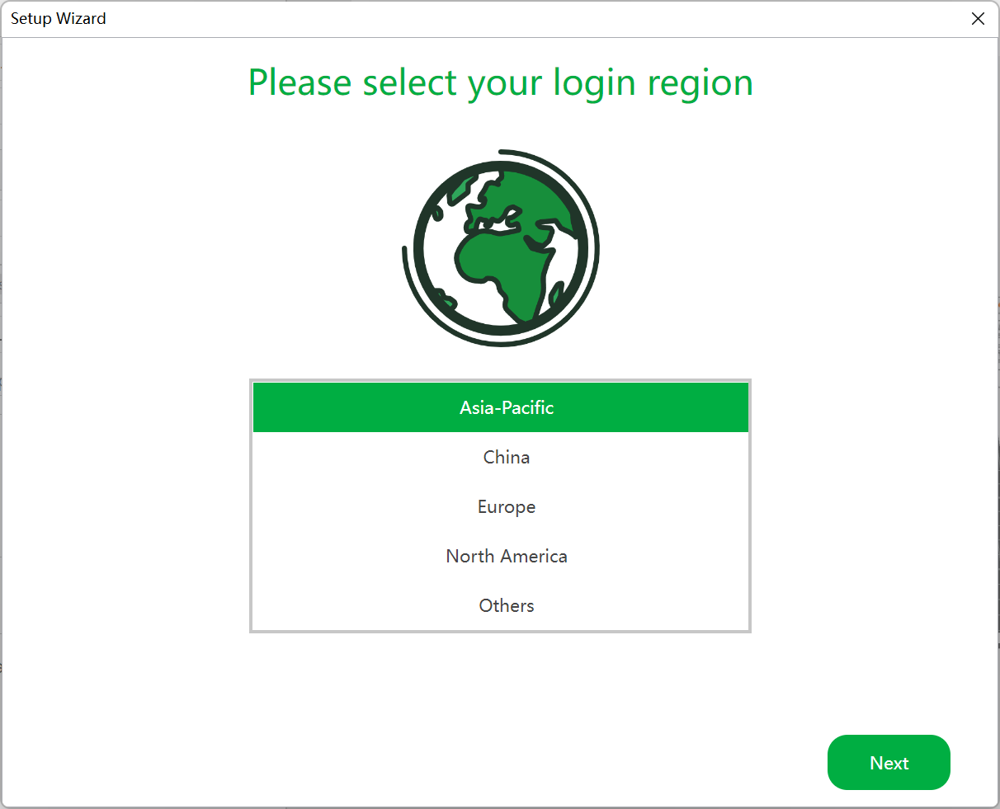
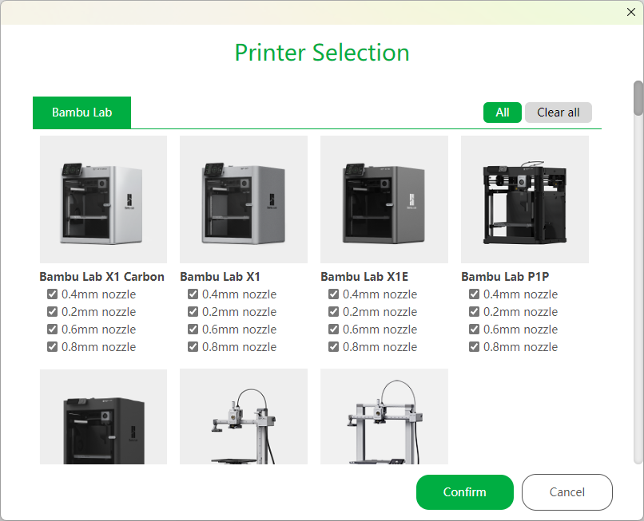
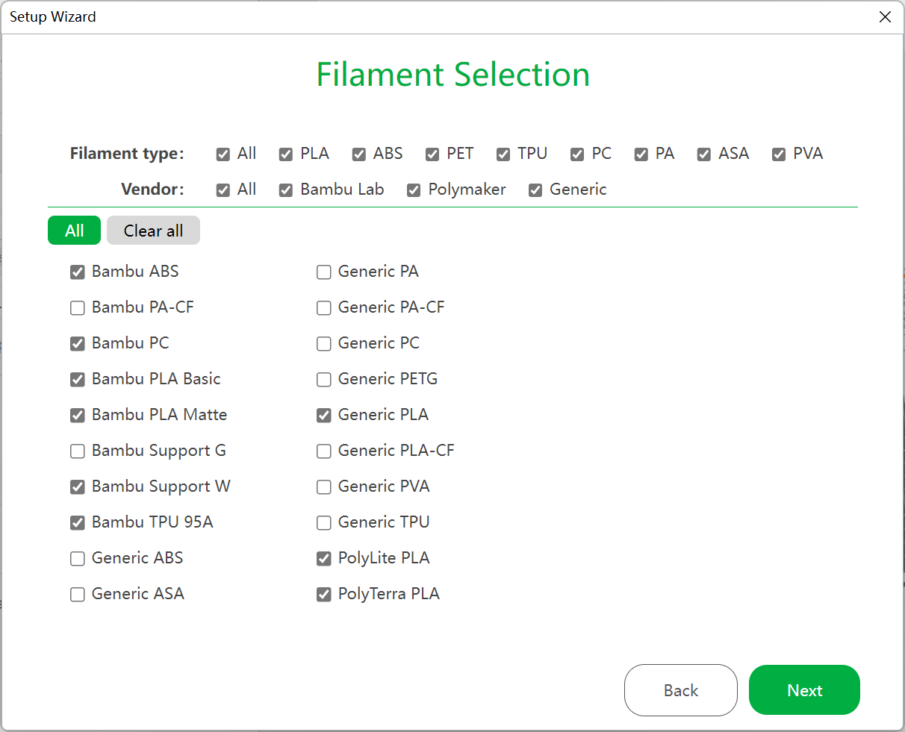
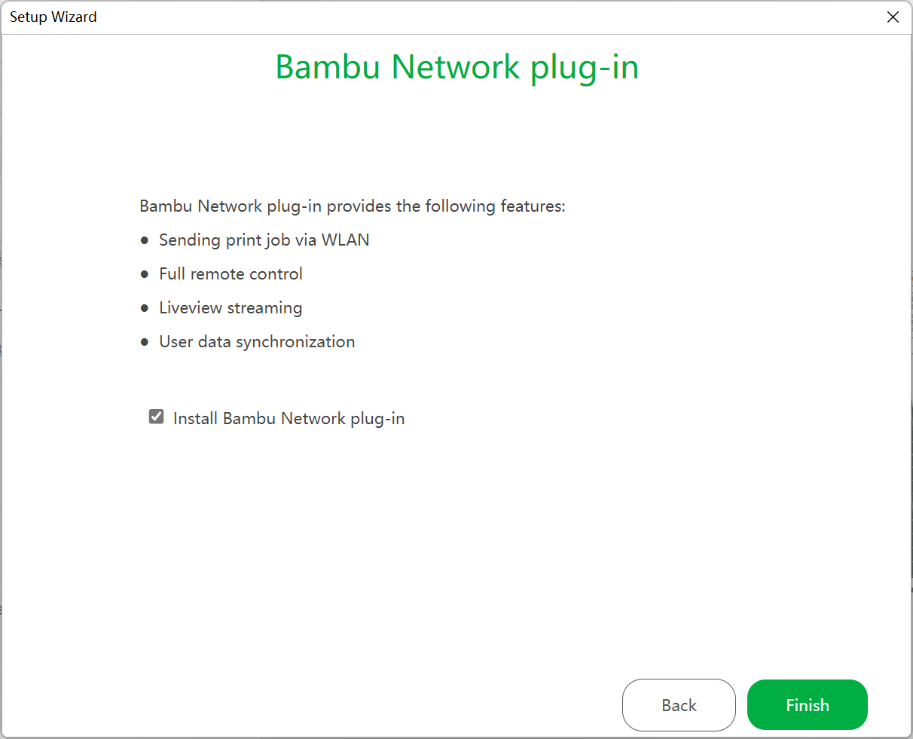

# What is Bambu Studio?

**Bambu Studio** is based on PrusaSlicer by Prusa Research, which is from Slic3r by Alessandro Ranellucci and the RepRap community.

Bambu Studio is our cutting-edge, feature-rich slicing software developed by Bambu Lab, which is used to prepare the files for 3D printing. It contains project-based workflows, `systematically optimized slicing algorithms`, and an easy-to-use graphic interface, bringing users an incredibly smooth printing experience.

# System Requirements

-   Windows 10 or higher
-   Mac OS X v10.15 or higher
-   Linux Ubuntu 20.02 or higher/Fedora 36 or higher \(Linux version needs to be downloaded from github\)
-   Intel® Core 2 or AMD Athlon® 64 processor; 2 GHz or faster processor
-   OpenGL 2.0-capable system
-   Recommend 8GB RAM, at least 4GB
-   2.0 GB or more of available hard-disk space

# Download & Installation

1. Download [Bambu Studio](https://bambulab.com/download)
1.Install Bambu Studio by following the step by step guide

# Setup Wizard

## Select Login Region

The first step is to select the region you are located in. A user account registered in North America for example, cannot log in if the region is set to China.

# Printer Selection

Choose the printers/nozzles that you would like displayed in the slicer operation menu. You may select any or all of the options available to you. These options can be altered at a later stage through the slicer menu should you wish to only choose one at this stage and decide to change nozzle size at a later stage

# Filament Selection

Select the filaments you would like to see listed in the filament preset list, you can choose as many as are available.

# Install Bambu Network Plug-in 

The Bambu Network plug-in provides networking capabilities, such as printing via WAN/LAN, remote control, user data sync. The plugin installation requires Internet connection and will be auto-installed \(if enabled\) after the setup wizard.

